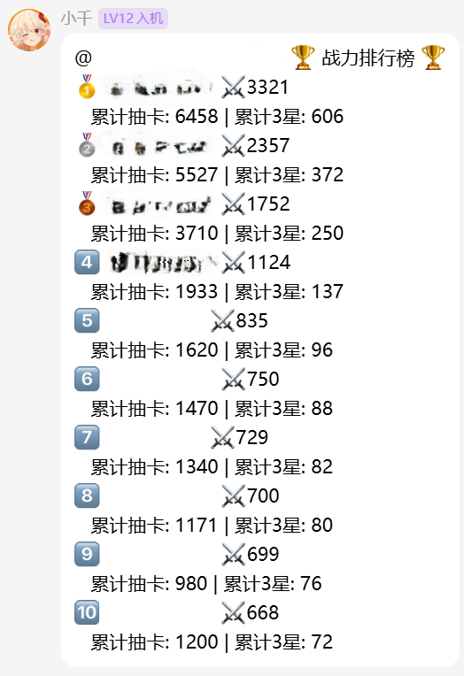

# TOARU Bot - 幻想收束的模拟抽卡QQbot

  
基于 Napcat 框架的ifbot

## 声明
本项目仅用于个人学习，不得用于商业用途

## 战绩
  

群友们一天抽了一万多次，鉴定为纯血ifp👍，账号已做脱敏处理

## 功能特性

### 抽卡系统
- 单抽 - 消耗300呱太抽取一张卡
- 十连 - 消耗3000呱太抽取十张卡  
- 保底机制 - 150抽必出FES限定三星，十连必出至少1个二星

### 机制
- 图片根据星级显示不同样式
- フェス限定三星使用特殊图
- 黑呱太，开出后为2星或3星
- 突变机制：开盲盒时有概率发生星级突变

### 战斗系统
- 根据卡牌的多种数据进行AI自动战斗
- 支持自动PVP、PVE
- 具有复杂词条的战斗系统

### 碎片
- 1星卡自动转化为1个红色碎片
- 2星卡自动转化为1个蓝色碎片
- 碎片可兑换呱太，有专属池子

### 签到
- 每日签到获得30000呱太

### 个人记录
- 显示累计抽卡、累计三星、碎片数量
- 分页显示所有三星卡收藏（每页10张）
- 重复三星卡显示计数标记
- 支持上一页/下一页翻页

### 排行榜
- 根据战斗胜负排名（前十名）
- AI占位

### 特殊信息
- 抽出FES角色时显示全服第几个该角色
- 触发FES保底时显示提示信息
- 三王女：输出十个三王女！

### 配队系统
- 使用三星卡配置队伍
- 队伍包含6个战斗位和6个支援位，自动分配位置
- 分页查看配置拥有的三星卡（每页50）
- 包含6个队伍槽位，可以自由切换
- AI自动配队

### 三星only
- 用碎片抽三星

## 如何食用：

### 1. 环境
- Python 3.8+
- [Napcat](https://github.com/NapNeko/NapCatQQ)

### 2. 安装依赖
```bash
pip install flask pillow openpyxl
```

### 3. 配置Napcat
参考 [NAPCAT_SETUP.md](NAPCAT_SETUP.md) 配置Napcat框架

### 4. 配置机器人
配置config.py

### 5. 资源文件
- `卡牌信息.xlsx`
- `iconimage/` - 角色卡图目录（card_cutin_xxx.png）
- `level/` - 框和背景图目录（gacha_tmb_xx_yy.png）

### 6. 运行NapCat
具体请参照[NapCat文档](https://napcat.napneko.icu/)

### 7. 运行机器人
```bash
python gacha_bot.py
```

## 使用说明

### 基本命令
| 命令 | 说明 |
|------|------|
| 单抽 | 抽一张（300呱太） |
| 十连 | 抽十张（3000呱太） |
| 获取呱太 | 获得10000呱太 |
| 签到 | 每日签到（30000呱太） |
| 个人记录 | 查看个人统计 |
| 兑换呱太 | 用碎片兑换呱太 |
| 排行榜 | 查看战力排行榜 |
| 详细信息 | 查看本次抽卡详细信息 |
| 帮助 | 显示帮助信息 |
| 三王女 | 输出十个三王女 |

### 开箱命令
| 命令 | 说明 |
|------|------|
| 1/2/3... 或 选择1/选择2... | 开启指定编号 |
| 全部开 | 开启所有 |
| 剩下的全部开 | 开启剩余未开 |

### 个人记录翻页
| 命令 | 说明 |
|------|------|
| 下一页 | 查看下一页三星卡 |
| 上一页 | 查看上一页三星卡 |

### 配队命令
| 命令 | 说明 |
|------|------|
| 队伍 | 查看当前队伍配置（图片） |
| 队伍 我的卡 | 查看拥有的三星卡 |
| 队伍 我的卡 下一页 | 查看下一页三星卡 |
| 队伍 我的卡 上一页 | 查看上一页三星卡 |
| 队伍 设置 位置 序号 | 将当前页序号的卡牌加入队伍 |
| 队伍 清除 位置 | 清除该位置的卡牌 |
| 队伍 清空 | 清空所有队伍配置 |

### 三星池子命令
| 命令 | 说明 |
|------|------|
| 三星池子 | 查看池子介绍和可抽取次数 |
| 红抽 | 使用1500红色碎片抽卡 |
| 蓝抽 | 使用350蓝色碎片抽卡 |

## 文件结构
```
/
├── gacha_bot.py          # 主程序
├── team_system.py        # 配队系统模块
├── 卡牌信息.xlsx         # 卡牌数据
├── iconimage/            # 角色卡图
├── level/                # 框和背景图
├── info/                 # 用户数据和日志
├── output/               # 临时输出图片
└── README.md             # 说明文档
```

## 更新日志

### v0.0.01 (2026-06-09)
- 初始版本发布
- 实现基础抽卡功能（单抽、十连）
- 支持角色图、框、背景图合成
- 添加呱太系统
- 添加保底机制
- 稍稍能用了

### v0.0.02 (2026-06-09)
- 修改保底为FES限定三星保底
- 实现三星概率分配
- 添加十连保底
- 添加FES统计功能

### v0.0.03 (2026-06-09)
- 添加碎片系统
- 添加个人记录查询
- 添加排行榜功能

### v0.0.05 (2026-06-09)
- 添加"十抽跳过"命令
- 添加"三王女"特殊命令

### v0.0.1 (2026-06-10)
- 实现三星卡收藏分页显示
- 重复三星卡显示计数标记
- 统一背景图处理方式
- 添加详细信息查询命令

### v0.0.11 (2026-06-10)
- 新增配队系统
	- 使用序号选择卡牌加入队伍
	- 自动识别卡类型

### v0.0.12 (2026-06-10)
- 新增三星only
- 显示可抽取次数

### v0.0.13 (2026-06-11)
- 修bug

### v0.0.14 (2026-06-11)
- 控制消息发送速率
- 增加日活数据，可以在后台看到
- 添加敏感词过滤能力

### v0.0.15 (2026-06-12)
- 增加自动对战系统，支持PVE和PVP
- 修改排行榜系统
- 自动配队

### v0.0.2 ！ (2026-06-13)
- 重构战斗系统，复刻了if6种属性、具有21个不同buff词条、多种状态效果的复杂战斗系统
- 修复排行榜系统
- 修复自动配队
- 增加了队伍的槽位，可以自由切换
- 大大压缩图片，降低网络耗费
- 添加管理员命令
- 热修复，修了巨多bug

### v0.0.21 (2026-06-15)
- 增加战斗GIF实时生成功能，待完善
- 修了一整天BUG，发现大大低估了这个功能的实现难度
- 这真的要模拟出一整个gameloop
- 吓哭了

### v0.0.22 (2026-06-16)
- 移植到了Kook！
- 后台转到了服务器
- 玩玩Kook的BOT
- 还是官方支持的bot好

## 许可证

Apache 2.0

## 贡献


